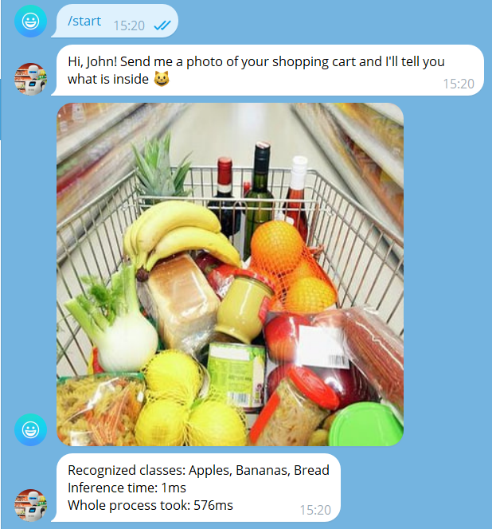

# Intro

Here you can find the source code of the telegram bot that interacts with the inference server that fetches the model from the roboflow server

# Prerequisites
1. 12 Gb space for docker images
2. Start Docker inference server on localhost:9001. 
You can do it with: ```docker-compose.yaml```
3. Set up environment variables for Java:
   1. API_KEY: Roboflow private key from ```app.roboflow.com/<your_name>/settings/api```
   2. BOT_TOKEN: Telegram bot API token retrieved from [BotFather](https://t.me/BotFather)
   3. OWNER_ID: Your telegram id or anyone who will receive feedback and other admin information from users

# How to

## Deploy

1. You can build the image of the bot from the [Dockerfile](Dockerfile) using: ```docker build . -t my-bot:latest```
2. Then you should replace ```services.telegram-bot.image``` value to  ```my-bot:latest```
3. And run everything with ```docker-compose up```

## Use

Send a picture (so-called photo) to the bot. Photo is the image **with** compression.

## Experiment

1. Tune **confidence** and **iou-threshold** in [application.yaml](src/main/resources/application.yaml)
2. Change **model-id** to yours. You can find it on Model page of your dataset on Roboflow.


# Example of interaction




